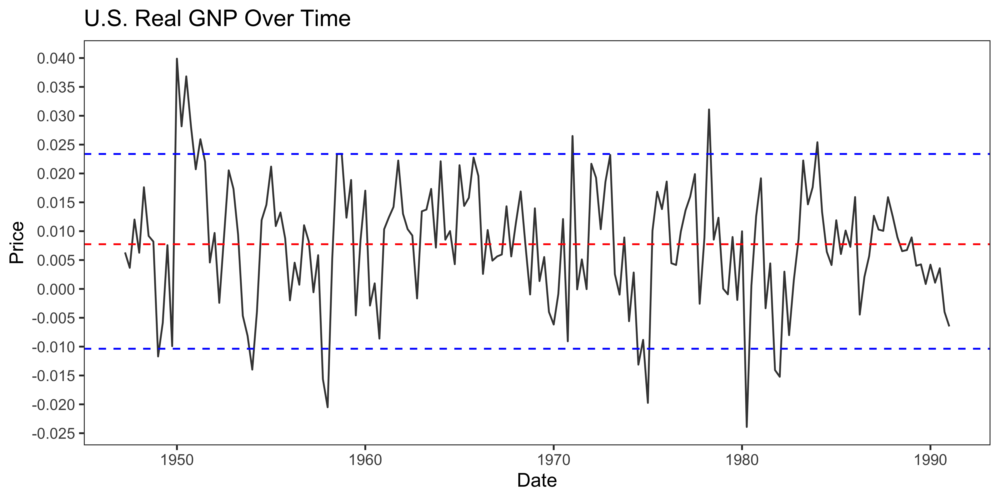
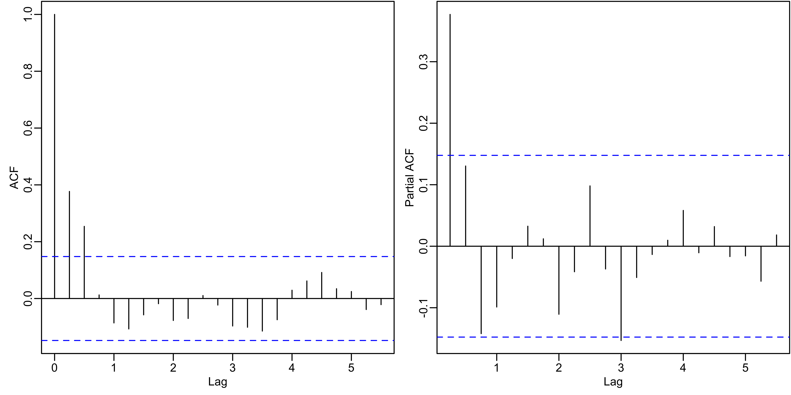
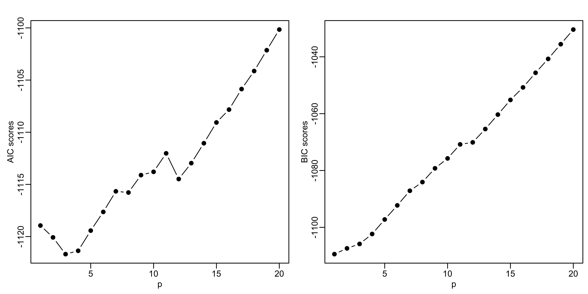
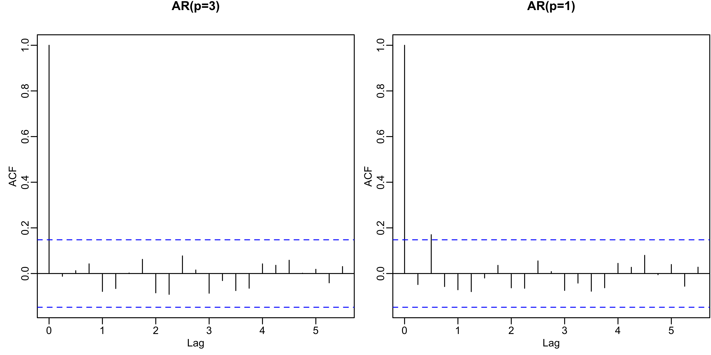
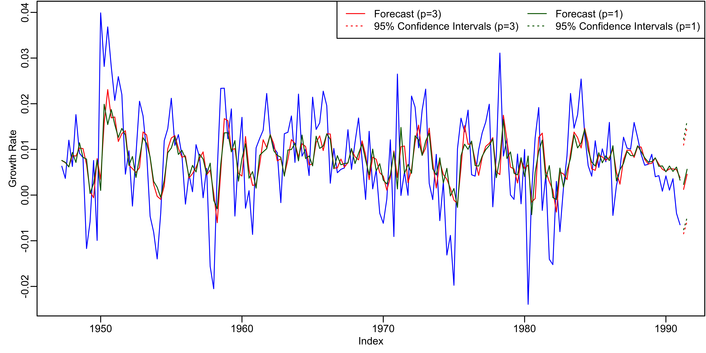
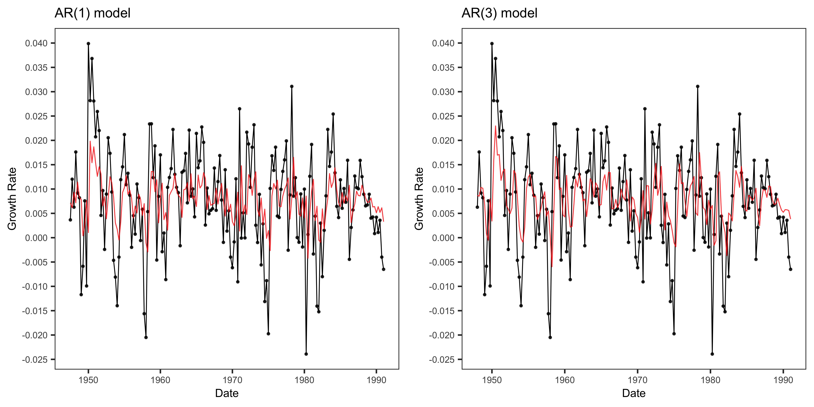
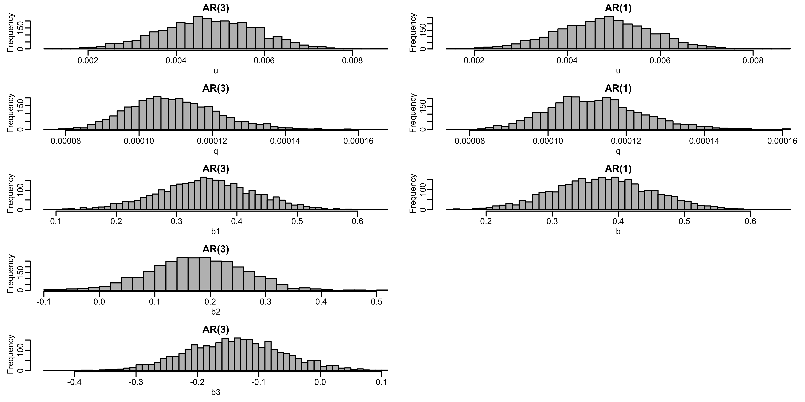
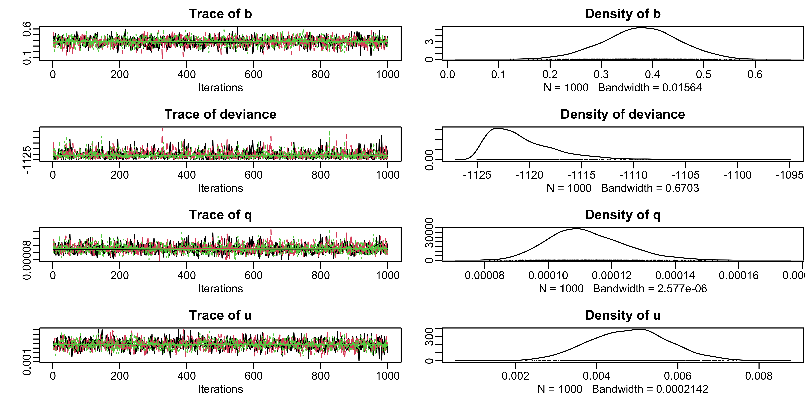
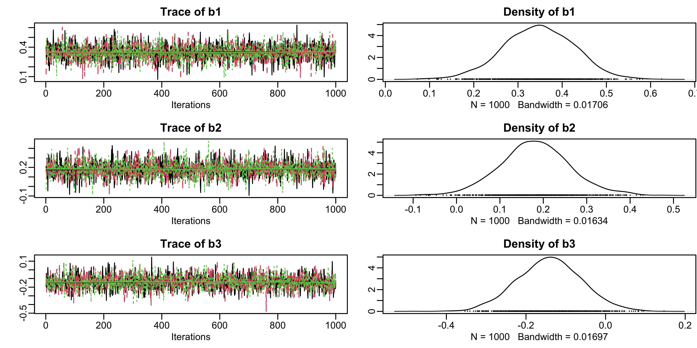
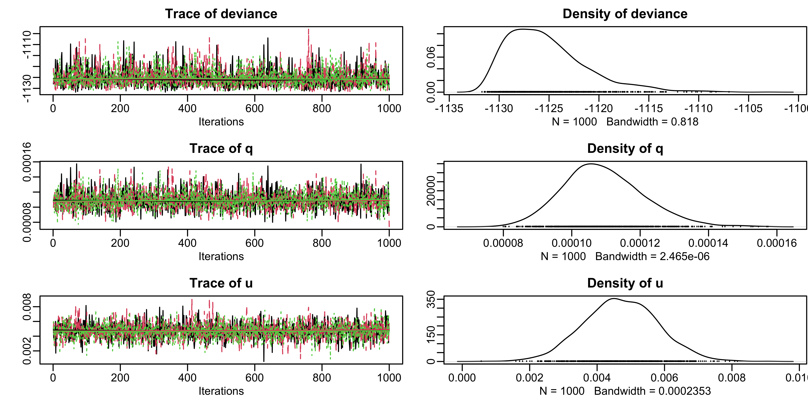

# Quarterly growth rate of U.S. real GNP

## Data Overview

Figure 1 indicates that the time series is second-order stationary with a constant mean and volatility. Moving forward, we proceed to check for autocorrelation patterns, aiming to understand the relationships between observations at different time lags and uncover any underlying temporal dynamics within the data.

<figcaption align = "center"><b>Figure 1: Quarterly Growth Rate of U.S. Real Gross National Product (GNP) Over Time.</b></figcaption> <br/>



## Classical ARIMA Approach for Time Series Modeling

A classical ARIMA (AutoRegressive Integrated Moving Average) model works by combining three main components: autoregression (AR), differencing (I for Integrated), and moving average (MA). It is a widely used time series forecasting model that aims to capture the temporal dependencies and patterns in sequential data. The AR component represents the linear relationship between the current observation and its past values. It involves regressing the current value on its own lagged values. The order of the AR component, denoted as "p," indicates the number of lagged terms considered in the regression.

### Selection of Optimal Model

Looking at Figure 2, which displays the autocorrelation function (ACF) plot on the left, we find a clear indication that the best choice for the ARIMA model's autoregressive parameter ($p$) seems to be 3 quarters. In the partial ACF plot, there's a noticeable drop-off in correlation around $p = 1$. This aligns with the observed theoretical patterns for an AR($p$) process, where exponential decay is oscillating, and the partial ACF cuts off at lag 1, suggesting an AR(1) process.

This initial visual assessment is complemented by a more detailed analysis involving Maximum Likelihood Estimation (MLE) and optimization for the Akaike Information Criterion (AIC). The theoretical and visual insights guide us towards selecting the optimal autoregressive order for our ARIMA model, striking a balance between accuracy and model complexity. 

<figcaption align = "center"><b>Figure 2: Autocorrelation function (ACF) plot and partial autocorrelation function (PACF) plot of quarterly growth rate of U.S. real GNP.</b></figcaption> <br/>



Upon a thorough examination of the information presented in Figure 3, it becomes evident that the optimal choice for the autoregressive parameter ($p$) in the AutoRegressive Integrated Moving Average (ARIMA) model is suggested to be 3 quarters. Figure 3 provides a visual representation of the relationship between different values of $p$ and the associated Akaike Information Criterion (AIC) scores, a measure of the model's goodness of fit while penalizing for complexity.

As we observe Figure 3, the AIC scores exhibit a discernible trend, reaching a minimum at $p = 3$, indicating the optimal ARIMA model for capturing underlying patterns in the time series data. However, further examination reveals that the results are slightly different than initially anticipated. The AICs for $p = 3$ and $p = 1$ are quite close, suggesting that both could be viable choices. Following the principle of parsimony, we might choose both $p = 3$ and $p = 1$ for the sake of comparison.

Normally, we would favor modeling the process with $p = 1$. However, it is worth noting that using the Bayesian Information Criterion (BIC) could alter our preference, potentially favoring an AR(1)-process. Figure 3 suggests that indeed, an AR(1)-process is the optimal choice using BIC. This underlines the importance of considering multiple criteria and thorough evaluation when selecting the optimal $p$ parameter for our ARIMA model.

<figcaption align = "center"><b>Figure 3: AIC (Akaike Information Criterion) and BIC (Bayesian Information Criterion) values for each fitted ARIMA model.</b></figcaption> <br/>




### Optimal Model

Table 1 presents the results of estimating two ARIMA models, specifically AR(3) and AR(1). The coefficient estimates for autoregressive terms reveal the impact of lagged values on the current observation. In Model 1, the ar1 coefficient is 0.348, indicating that a one-unit increase in the first lag corresponds to an estimated 0.348-unit increase in the present observation. Similarly, in Model 2, the ar1 coefficient is 0.379. Positive coefficients for ar2 in Model 1 suggest positive effects for the second lag, unlike the third lag, where the trend is reversed. The intercept term, consistently maintained at 0.008 across both models, represents the constant term. Standard errors, provided in parentheses beneath each coefficient, convey the precision of the estimates. P-values, located at the table's bottom, signify the statistical significance of each coefficient. Notably, at a 1\% significance level, only the first lag is significant in both models, emphasizing its importance in explaining the observed variations.

<figcaption align = "center"><b>Figure 4: Autocorrelation function (ACF) plot of the optimal models’ residuals.</b></figcaption> <br/>



Examining Figure 4, depicting the autocorrelation function (ACF) plot for the residuals of our AR(3) model, reveals a crucial insight. Notably, there are no significant patterns or correlations among the residuals. This absence of structured behavior among the residuals is an encouraging indication, suggesting that our AR(3) model fits well. The residuals, representing the unexplained variation in the data, do not exhibit clear patterns over time. This implies that the choice of AR(3) is effective in capturing the underlying patterns in our data, showcasing the robustness of the model.

Consequently, based on Figure 4, it appears that our AR(3) model is performing well. However, when we inspect the autocorrelation function of AR(1), a noteworthy observation emerges. There is still a significant spike at the third quarter, indicating that certain temporal dependencies may not be fully captured by the AR(3) model alone.

In conclusion, while the AR(3) model demonstrates effectiveness in capturing patterns within the data, the persistence of a significant spike in the autocorrelation function at the third quarter suggests the presence of additional temporal dynamics. It might be worthwhile to explore alternative model configurations or consider additional factors that could enhance the model's performance and provide a more comprehensive representation of the underlying time series.

### Forecast 

<figcaption align = "center"><b>Figure 5: ARIMA forecast of the U.S. real GNP growth rate with confidence intervals.</b></figcaption> <br/>



Figure 5 presents forecasted values indicating a positive trend in the growth rate of the U.S. real Gross National Product (GNP) for the next two quarters. This optimistic outlook suggests the potential for economic expansion. Acknowledging the inherent uncertainty inherent in forecasts, this visual observation provides an initial indication of a positive trajectory in short-term economic growth. Notably, the forecasted values exhibit consistency across both AR(3) and AR(1) processes, although the AR(3) model appears more adept at capturing the spikes observed in the actual data. This suggests that, despite similarities in the overall trend, the AR(3) model provides a more nuanced and accurate representation of the data dynamics, enhancing its reliability in forecasting economic growth.


## Bayesian Approach for Time Series Modeling

A Bayesian ARIMA model integrates Bayesian principles with the classic ARIMA framework for time series analysis. It begins by specifying a prior distribution that reflects initial beliefs about the model parameters. This prior is combined with a likelihood function, representing the probability of observing the data given the parameters. Using Bayes' theorem, these components yield a posterior distribution, representing updated beliefs after incorporating the observed data. To navigate the complex parameter space, Markov Chain Monte Carlo (MCMC) methods, like the Gibbs sampler, are employed for efficient sampling. The MCMC samples inform parameter estimates, enabling the model to fit the data and make probabilistic predictions. Bayesian ARIMA models offer a flexible and probabilistic approach, providing richer insights and uncertainty quantification compared to traditional ARIMA models. Here, we define the regressors and specify the number of observations for the AR(1) model using JAGS (Just Another Gibbs Sampler).


### In-Sample Results

<figcaption align = "center"><b>Figure 6: Visualization depicting the In-Sample Fit of a Bayesian ARIMA Model, providing insights into the model’s performance on the observed data.</b></figcaption> <br/>



Figure 6 showcases a comparative analysis of two autoregressive models, AR(1) and AR(3), through time series graphs plotting the growth rate from 1950 to just before 2000. The left graph, titled "AR(1) model", and the right graph, titled "AR(3) model", both display observed data points in black, connected by lines to depict the growth rate over time, with a red line indicating the fitted values from the respective ARIMA models. This visualization, referred to as "Figure 6", aims to illustrate the in-sample fit of a Bayesian ARIMA Model, highlighting the model's performance in capturing the observed data's patterns. The fit looks similar and reasonably good for both models as the red line follows the general pattern of the observed data, although there are points where the observed data shows more volatility than the model captures. 

Figure 7 offers a thorough exploration of the posterior parameter distributions for both AR(3) and AR(1) models, utilizing histograms derived from Bayesian estimation methods. These histograms play a crucial role in gaining insights into the variability and certainty associated with the model parameters, which, in turn, wield substantial influence over the model's predictions and interpretations.

Specifically for the AR(3) model, the histograms represent distributions for parameters 'u', 'q', 'b1', 'b2', and 'b3', each vividly illustrating the spread and central tendency of the estimates. The complexity of this model is underscored by its reliance on three lagged values, evident from the presence of multiple 'b' parameters. This allows the model the potential to capture more intricate patterns within the data. In contrast, the AR(1) model's histograms for 'u', 'q', and 'b' mirror its simpler structure, relying on a single lagged value for predictions. Moreover, the narrower spread observed on the 'q' and 'b' parameters suggests a heightened level of certainty regarding the parameter values within the AR(1) model.

<figcaption align = "center"><b>Figure 7: Exploring Posterior Parameter Distributions: A Bayesian Estimation Histogram.</b></figcaption> <br/>




### Model Diagnostics

```
Iterations = 1:1000
Thinning interval = 1 
Number of chains = 3 
Sample size per chain = 1000 

1. Empirical mean and standard deviation for each variable,
   plus standard error of the mean:

               Mean        SD  Naive SE Time-series SE
b         3.776e-01 7.460e-02 1.362e-03      1.420e-03
deviance -1.121e+03 3.431e+00 6.264e-02      6.277e-02
q         1.122e-04 1.235e-05 2.254e-07      2.254e-07
u         4.811e-03 1.002e-03 1.830e-05      1.943e-05

2. Quantiles for each variable:

               2.5%        25%        50%        75%      97.5%
b         2.236e-01  3.295e-01  3.785e-01  4.275e-01  5.210e-01
deviance -1.125e+03 -1.123e+03 -1.121e+03 -1.119e+03 -1.112e+03
q         9.113e-05  1.037e-04  1.110e-04  1.198e-04  1.397e-04
u         2.848e-03  4.121e-03  4.835e-03  5.471e-03  6.841e-03
```

The output above presents the findings of a Bayesian estimation conducted over 1000 iterations, with a thinning interval of 1, employing three chains, each generating a sample size of 1000. The empirical mean and standard deviation, along with the standard error of the mean and time-series standard error, are provided for key variables ('b', 'deviance', 'q', and 'u'). For instance, the parameter 'b' exhibits an empirical mean of 0.376 and a standard deviation of 0.075, indicating its average value and variability. The 'deviance', representing model fit, has a mean of -1121 and a standard deviation of 3.151, with quantiles offering insights into the distribution. Similarly, 'q' and 'u' parameters are characterized by their means and quantiles, shedding light on their central tendency and variability. 

```
Iterations = 1:1000
Thinning interval = 1 
Number of chains = 3 
Sample size per chain = 1000 

1. Empirical mean and standard deviation for each variable,
   plus standard error of the mean:

               Mean        SD  Naive SE Time-series SE
b1        3.468e-01 7.980e-02 1.457e-03      1.440e-03
b2        1.811e-01 8.056e-02 1.471e-03      1.505e-03
b3       -1.408e-01 8.061e-02 1.472e-03      1.510e-03
deviance -1.125e+03 4.070e+00 7.431e-02      7.429e-02
q         1.092e-04 1.189e-05 2.170e-07      2.172e-07
u         4.707e-03 1.102e-03 2.012e-05      2.145e-05

2. Quantiles for each variable:

               2.5%        25%        50%        75%      97.5%
b1        1.862e-01  2.928e-01  3.478e-01  4.019e-01  4.993e-01
b2        2.341e-02  1.298e-01  1.799e-01  2.322e-01  3.482e-01
b3       -3.010e-01 -1.940e-01 -1.406e-01 -8.760e-02  1.950e-02
deviance -1.131e+03 -1.128e+03 -1.126e+03 -1.123e+03 -1.115e+03
q         8.839e-05  1.012e-04  1.082e-04  1.167e-04  1.348e-04
u         2.573e-03  3.966e-03  4.691e-03  5.441e-03  6.864e-03
```

The output provided above details the outcomes of a Bayesian estimation process conducted over 1000 iterations with a thinning interval of 1, utilizing three chains, each producing a sample size of 1000. The first section presents the empirical mean, standard deviation, naive standard error, and time-series standard error for key variables ('b1', 'b2', 'b3', 'deviance', 'q', and 'u'). Notably, 'b1' has an empirical mean of 0.3441 with a standard deviation of 0.0785, indicating its average value and variability. The second section provides quantiles (2.5%, 25%, 50%, 75%, 97.5%) for each variable, offering insights into the distribution of parameter estimates. For instance, the 50th percentile (median) values for 'b1', 'b2', 'b3', 'deviance', 'q', and 'u' provide central tendencies, while the range between the 2.5th and 97.5th percentiles illustrates the spread of the estimates.

<figcaption align = "center"><b>Figure 8: Visualizing the Results of Bayesian AR(1) model.</b></figcaption> <br/>



Figure 8 presents a comprehensive set of plots elucidating the outcomes derived from Bayesian analysis. Each row is dedicated to a specific parameter or variable, with the left column showcasing trace plots and the right column presenting density plots for the corresponding parameters. In the initial row, the trace plot for parameter ‘b’ illustrates fluctuations around an approximate value of 0.35 across 5000 iterations, indicating that the MCMC sampling converges around this central value. The accompanying bell-shaped density plot for ‘b’ suggests a distribution reminiscent of normality in the sampled values. Progressing to the second row, both the trace plot and density plot for the deviance portray fluctuations within a discernible range, with the latter exhibiting a characteristic bell-shaped distribution. The third row features the trace plot for parameter ‘q,’ revealing values oscillating within a narrow range, complemented by a corresponding bell-shaped density plot peaking around 0.00012. In the fourth row, both the trace plot and density plot for parameter ‘u’ display subtle fluctuations within small ranges and bell-shaped distributions, respectively. The trace plots serve as a valuable tool for evaluating the convergence of the MCMC algorithm, while the density plots provide nuanced insights into the posterior distributions of the analyzed parameters.

Figure 9 illustrates trace plots and density plots, illustrating parameters and deviance derived from a Bayesian AR(3) model. Analyzing these plots reveals valuable insights. Trace plots, depicting the evolution of parameters or variables throughout Markov Chain Monte Carlo (MCMC) iterations, showcase the values for b1, b2, b3, deviance, q, and u. The "hairy caterpillar" pattern in well-mixed MCMC chains signifies effective exploration of the parameter space, and in this instance, the traces exhibit favorable mixing with oscillations around a stable mean, lacking discernible trends or periodicity. Density plots, portraying posterior parameter distributions, unveil unimodal distributions for b1, b2, b3, deviance, q, and u. This implies a singular most probable value for each parameter, discernible from the peak of the density. Parameters b1, b2, and b3, potentially autoregressive coefficients in the AR(3) model, exhibit peaks around 0.3, 0.1, and -0.1, respectively, with narrow bandwidths denoting precision in posterior estimates. Deviance, a metric gauging model fit, manifests variation within a range in its trace plot, while the corresponding skewed left-leaning density plot suggests concentration of sampled values towards lower values, indicative of a desirable fit. Parameters q and u, possibly associated with error term variance, display stable oscillations in their trace plots and unimodal density plots with narrow peaks, signifying precise estimates. In summary, the MCMC simulation displays promising convergence, evident in the "hairy caterpillar" trace plots and unimodal, narrow density plots. This convergence indicates well-defined posterior parameter distributions, affirming the effective estimation of model parameters through the Bayesian inference process.

<figcaption align = "center"><b>Figure 9: Visualizing the Results of Bayesian AR(3) model.</b></figcaption> <br/>




### Forecast

<figcaption align = "center"><b>Figure 10: Bayesian forecast of the U.S. real GNP growth rate.</b></figcaption> <br/>



Figure 10 provides an insightful visualization of forecasted values. The depiction includes a black line with data points marked by dots, likely representing observed or actual growth rates over time. Additionally, a red line, appearing smoother, likely signifies Bayesian forecasted growth rates. The black line exhibits fluctuations in the growth rate over the years, displaying peaks and troughs. In contrast, the red line, while following the general trend of the black line, smoothens out volatility. This smoothing characteristic aligns with the typical behavior of a forecast line, aiming to predict the underlying trend rather than replicating noise present in the actual data. Notably, the forecasted values reveal a positive trend in the growth rate of U.S. real Gross National Product (GNP) for the upcoming two quarters, suggesting an optimistic outlook and the potential for economic expansion. Acknowledging the inherent uncertainty linked with forecasts, this visual observation serves as an initial indicator of a positive trajectory in short-term economic growth.

In summary, a comparison of the frequentist and Bayesian approaches reveals striking similarities, particularly in the lag one coefficients and the projected future values. The consistency observed in the lag one coefficients suggests a convergence of results between the two methodologies. Additionally, the future forecasted values exhibit notable coherence. This alignment between the two approaches strengthens the confidence in the reliability and robustness of the analyses, showcasing a harmonious outcome in both the historical estimations and the forward-looking projections.


## Authors

Jacopo Liera, Marcell Frisch, Marcell Tatar, Ema Vargova
